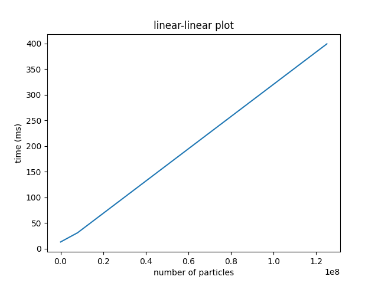
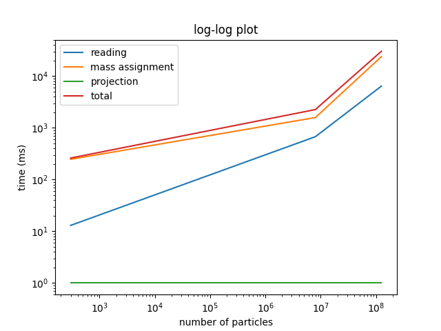
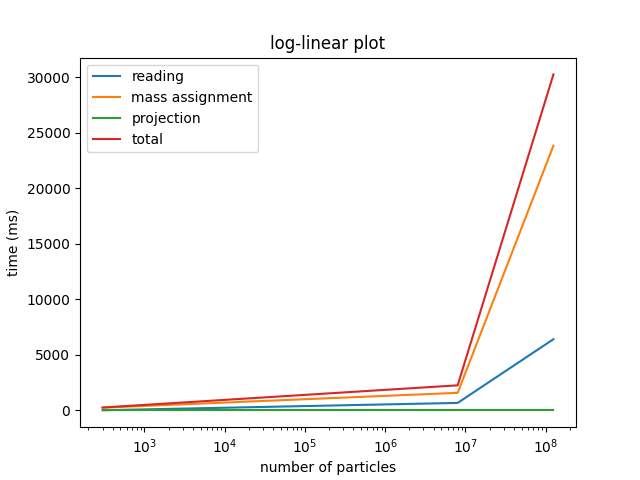
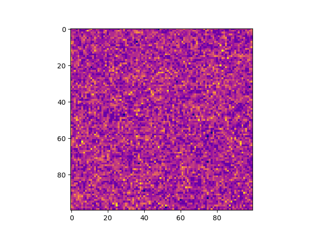
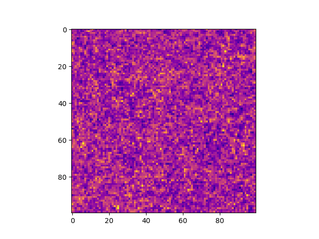
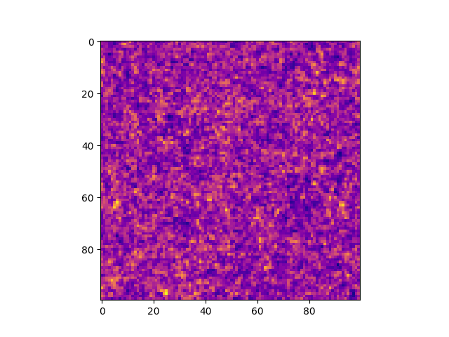

# Exercise 3

## 2

**100^3**  
Reading file took: 0 ms
Mass assignment took: 12 ms
Projection took: 1 ms

**200^3**  
Reading file took: 0 ms
Mass assignment took: 31 ms
Projection took: 0 ms

**400^3**  
Reading file took: 1 ms
Mass assignment took: 397 ms
Projection took: 1 ms

The linear linear plot is not very readbale as the first two measurements are very close by on the x-axis. 

The log-log tells the story the best, as the runtime is linear in the number of elements. (todo)

## 3

*ngp* kernel

*cic* kernel

*tsc* kernel

*psc* kernel

