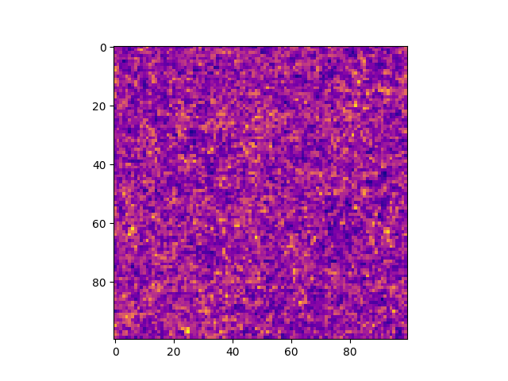

# Exercise 4

## 1 & 2

```cpp
typedef std::complex<float> cplx;
int mem_size = nGrid * nGrid * (nGrid+2);
float *memory_in = new (std::align_val_t(64)) float[mem_size];

TinyVector<int, 3> in_shape(nGrid, nGrid, nGrid);
Array<float,3> in(memory_in, in_shape, deleteDataWhenDone);

```

## 3
    
```cpp
Array<float,3> in_no_pad = in(Range::all(), Range::all(), Range(0,nGrid-1));
```

Previous mass assignment (ngp)   | Current mass assignment (ngp)
:-------------------------:|:-------------------------:
  |  

The two assigments look identical as expected.

## 4

```cpp
cplx *memory_out = reinterpret_cast <cplx*>( memory_in );
TinyVector<int, 3> out_shape(nGrid, nGrid, nGrid/2+1);
Array<cplx,3> out(memory_out, out_shape, deleteDataWhenDone);
```

## 5

```cpp

fftwf_plan plan = fftwf_plan_dft_r2c_3d(nGrid, nGrid, nGrid, memory_in, (fftwf_complex*) memory_out, FFTW_ESTIMATE);
fftwf_execute(plan);
fftwf_destroy_plan(plan);

```

The cast ``(fftwf_complex*)`` is safe as written in the fftw documentation. To link fftw we adapt the makefile as follows:

```makefile	
CXX	= g++

CFLAGS = -O3 -std=c++17
LDFLAGS = -lfftw3f -lm -fopenmp

assign	: assign.o tipsy.o
	$(CXX) $(CFLAGS) -o assign assign.o tipsy.o $(LDFLAGS)

assign.o : assign.cxx tipsy.h
	$(CXX) $(CFLAGS) -c -o assign.o assign.cxx $(LDFLAGS)

tipsy.o : tipsy.cxx tipsy.h	
	$(CXX) $(CFLAGS) -c -o tipsy.o tipsy.cxx $(LDFLAGS)

clean:
	rm -f assign assign.o tipsy.o
```
