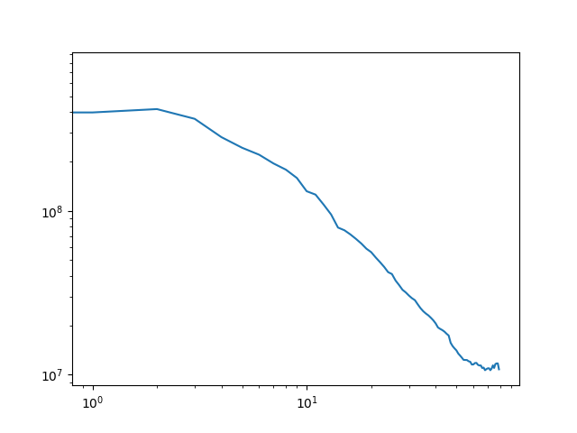
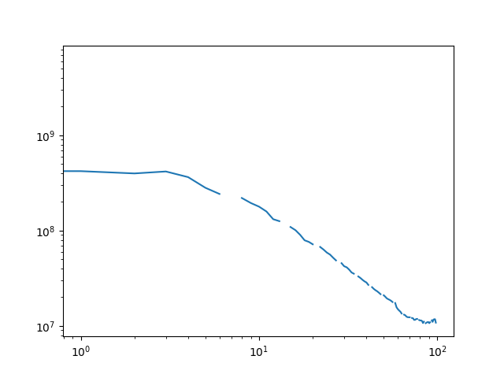

# Task 1

Check out the [code](mass_assignment/helpers.cxx) where the function ``bin`` is relevant. 


# Task 2

Example output of the program:

```{bash}
1.25831e+09 3.93408e+08 4.14739e+08 ...
0 1 2 ...
```

The file is written from [main](mass_assignment/main.cxx) with the ``write`` function. 

# Task 3

Table describing the results:

| 80 bins | 100 bins (==nGrid) |
|----------------|----------------|
| |              |


# Task 4

Power spectrum with 80 bins and logaritmic binning:

