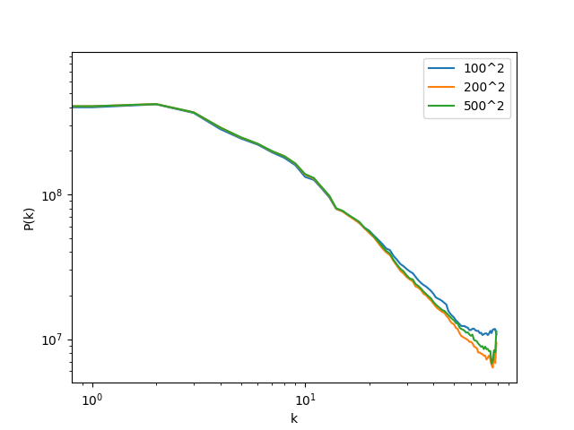

# Exercise 07

## Task 1

```{bash}
mpirun -n 2 main ../data/B100.00100 100 ngp
```
It does not parallelize the work but simply runs everything twice.

## Task 2

Table of results:

| # of processes | read file [ms] | mass assignment [ms] |
|----------------|----------------|----------------------|
| 1              | 11             | 233                  |
| 2              | 6              | 127                  |


## Task 3

Power spectrum with 80 bins and logaritmic binning:

